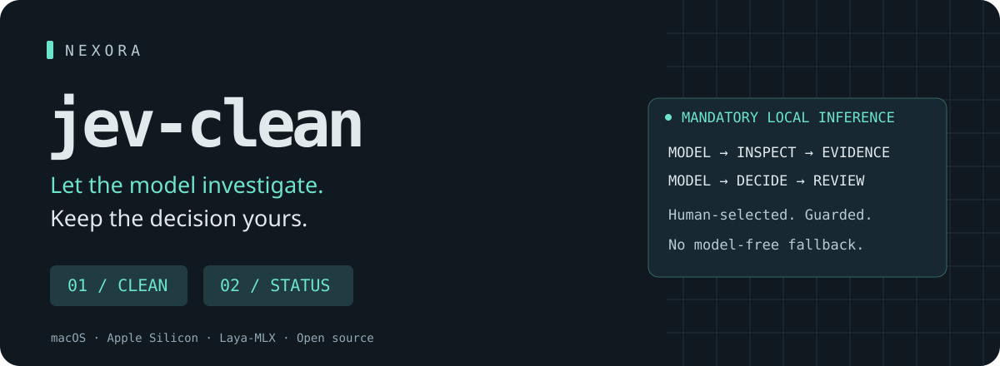
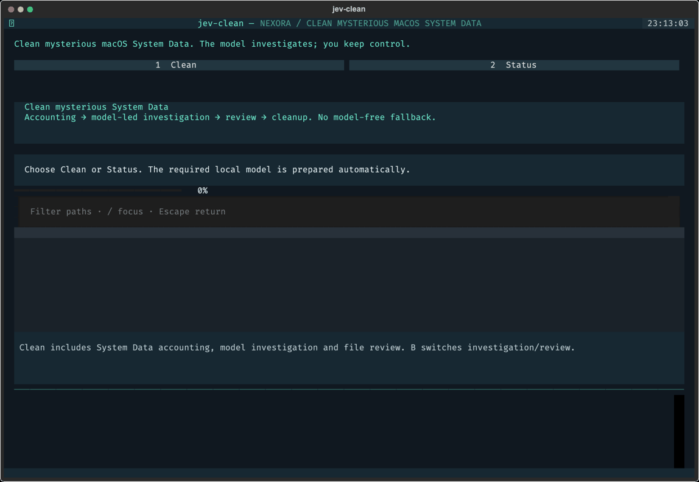

<p align="center"></p>

# jev-clean · Nexora

**Clean the mysterious “System Data” on your Mac—with a local model doing the investigation.**

[](https://github.com/chengyixu/jev-clean/actions/workflows/ci.yml)
[](LICENSE)


macOS calls hundreds of gigabytes **System Data**. That label doesn't tell you what the data is, why it exists, or whether you can remove it.

**Clean is the flagship System Data workflow—not merely a report in Status.** It starts with System Data accounting, sends the model to investigate potential contributors, brings its removal proposals into the same review screen, and lets you choose what goes. Press `B` inside Clean to switch between the model's investigation and the file review; the System Data panel stays visible throughout. Status provides a read-only deeper breakdown.

Laya chooses which locations need inspection, classifies the evidence, and proposes what to keep or remove. You see the actual choices and scores as they happen. You approve the files. Hard safety protections can veto a model proposal, never replace the model.

> **Alpha software.** No model = no Clean or Status operation. There is no rules-only fallback. Model scores are **not deletion-safety guarantees**. Begin with the real-inference demo and review [SECURITY.md](SECURITY.md). The project name does not imply affiliation with TypeSafe AI; the shipped engine is Laya-MLX.

<p align="center"></p>

*Actual TUI and real local inference; synthetic filesystem metadata. This is a screen-sequence walkthrough, not real-time playback. No private files or canned neural scores.*

## Two modes. The model drives both.

| | **Clean** | **Status** |
|---|---|---|
| Question | “What can I remove to tackle mysterious System Data?” | “Where is the space actually going?” |
| Model’s job | Choose directories to inspect → find potential trash → propose remove / review / keep | Choose deeper disk breakdown → classify storage → expose unresolved areas |
| Tools’ job | Return bounded filesystem evidence, not recommendations | Measure chosen locations; collect native/APFS evidence |
| Your control | Select all approved items or some; review and confirm | Read-only investigation; narrow the next scope |
| Result | System Data context + model findings + selected cleanup + receipt/undo | Private JSON report and model decision trace |

**The loop:** model chooses → tools inspect → model assesses new evidence → repeat within the visible budget → you review. Filesystem checks can veto symlinks, active files, databases and unsafe paths. They cannot mark something as trash without a model decision.

### Honest about the gray bar

Where available, jev-clean reconciles a same-timestamp native record:

```text
Used space − macOS − named categories = System Data (“Other”)
```

It keeps that accounting separate from filesystem allocation. Nested directories overlap; sparse VM files and APFS clones complicate reclaim estimates. Large folders are **not automatically proven members of System Data**. Unavailable native logs, permissions gaps and unexplored branches remain visible. No invented “263 GB explained” headline.

## Install

Requires **Apple Silicon macOS** and `python3` to run the installer. It provisions uv if needed, an isolated Python 3.12 app environment, and the required model automatically. The underlying MLX runtime declares macOS 14+ support; live inference is tested here on macOS 27.0. Intel Macs and Linux cannot run the application model.

```bash
d="$(mktemp -d)" && curl -fL https://github.com/chengyixu/jev-clean/releases/download/v0.1.1/install.py -o "$d/install.py" && python3 "$d/install.py"
jev-clean
```

**One install flow: app → pinned model (~0.85 GB) → checksum verification → real inference test → Ready.** No separate model-setup command. The installer exits with failure if the model cannot be provisioned or run; it never calls an app-only installation complete. Review the [installer source](install.py) and release checksums if desired. It prints the exact launch path if your uv executable directory is not on PATH.

No API key, cloud inference, account, daemon, password capture or sudoers change. Run the installer and app **without sudo**. After installation, inference is local. Advanced direct-package installs also automatically provision missing weights on the first Clean/Status operation; network/download failure stops the operation, never produces a fallback.

### Try the model without touching your files

```bash
jev-clean clean --demo
jev-clean status --demo
```

The demo feeds synthetic disk metadata through **real mandatory Laya inference**. It cannot move real files. An incomplete model cache is provisioned automatically; failed provisioning stops the operation.

### Permission flow

After selecting Clean or Status, choose native sudo diagnostics or explicitly request unprivileged inspection. For sudo, Textual hands control back to the terminal for `sudo -v`. Passwords never enter Python, the agent or the model. Cancelled/failed authentication starts no investigation. Sudo broadens read-only native evidence—not deletion power—and does not bypass SIP, TCC or Full Disk Access.

## Agent skill and JSON CLI

The agent skill uses the exact same engine and safety boundaries. Install/link the [skill directory](skills/jev-clean) using your agent's skill manager, then invoke `/jev-clean` or ask it to inspect disk usage.

```bash
jev-clean status --json
jev-clean status --json --root "$HOME/Library/Application Support"
jev-clean clean --json --root "$HOME/Library/Caches" \
  --output "$HOME/.local/state/jev-clean/review.json"

# Optional deeper native READ access: human authenticates in their own terminal.
sudo -v
jev-clean status --deep --json

# ONLY after the human reviews and approves these particular IDs:
jev-clean apply "$HOME/.local/state/jev-clean/review.json" \
  --ids ID1,ID2 --confirm TRASH
```

`--root` narrows the model's investigation, not its deletion permissions. The JSON `system_data` section carries native total/residual, candidate bytes and attribution limits for **both** modes. Plans expire in one hour. Every chosen file needs a `remove` decision and a guard pass; applying a plan re-runs model assessment and identity/open-file checks. Invalid or missing model output stops the operation. Reports contain private paths: **do not upload them**.

## Controls and utilities

| Key | Action |
|---|---|
| `1` / `2` | Clean System Data / Status |
| `B` | In Clean, switch System Data investigation / file review |
| `↑ ↓` or `j k` | Navigate |
| `Space` | Toggle a model-approved, safety-checked file |
| `A` / `N` | Select all visible approved / select none |
| `/` | Filter paths |
| `Enter` | Final review; type `TRASH` to confirm |
| `R` | New model investigation |
| `E` | Export private report |
| `H` | History and undo instructions |
| `U` | Check release updates |
| `?` / `Esc` / `Q` | Help / cancel / quit |

```bash
jev-clean doctor
jev-clean history
jev-clean restore BATCH_ID --confirm RESTORE
jev-clean update           # check only
jev-clean update --apply   # confirm update; model provision + inference verified before ready
jev-clean completion zsh   # also bash and fish; prints, doesn't modify shell config
```

**Trash is not free space.** Staging is reversible; it does not immediately reclaim bytes. jev-clean never automatically empties Trash. Restore refuses to overwrite an existing file.

## Why Laya-MLX?

Laya is a typed-decision encoder: one bounded question goes in, a choice distribution comes out. No token-by-token prose or model-generated shell code. The pinned [aac6fef/laya-mlx](https://huggingface.co/aac6fef/laya-mlx) checkpoint runs natively with MLX on Apple Silicon.

We researched the English, multilingual and typed-decision Laya families plus open Jev reproductions. “Jev” search results are not a single interchangeable model. See [the source-linked research](docs/RESEARCH.md), [architecture decision](docs/adr/0001-local-decisions.md) and [product contract](docs/PRODUCT.md).

### What the measurements actually say

A local 12-case synthetic-metadata diagnostic produced **7/12 exact expected choices**. None of the nine protected/uncertain fixtures became selectable; **that is the combined model-plus-veto result, not proof that the model is safe**. Model proposals can be wrong. The diagnostic is small, hand-authored and related to prompt-development examples—not an independent accuracy benchmark. Raw outputs, timings, mismatches and limitations are published in [model-evaluation.json](docs/model-evaluation.json).

We do not claim superior cleanup accuracy to Mole or that local inference understands every file. The distinction is a visible, mandatory model-driven investigation and a strict human-controlled execution boundary.

## Safety scope

- No root deletion, recursive tree deletion, app uninstallation or automatic Trash emptying.
- Databases, VM disks, model weights, source work, credentials and backups are not blanket cleanup targets.
- This release can stage only stale regular files in narrow disposable cache/rotated-log roots.
- Scope, owner, age, symlink/hard-link status, inode/mtime/ctime and open handles are checked again at execution.
- Unknown open-file status or incomplete file metadata is a veto.
- Model decisions are mandatory; safety checks only restrict them.
- Same-user concurrent writers remain a race risk. Close relevant apps before cleanup. See [threat model](SECURITY.md).

## Develop / reproduce

```bash
git clone https://github.com/chengyixu/jev-clean.git
cd jev-clean
uv sync --frozen --extra dev --python 3.12
uv run bash scripts/verify.sh
uv run python scripts/evaluate_model.py --output docs/model-evaluation.json  # cold cache provisions automatically
uv run python scripts/capture_demo.py
```

Hermetic tests use temporary directories and an explicit neural-adapter test double; the application has no fake-model switch. Real-inference evaluation and media capture automatically provision a missing checkpoint, just like the app. On macOS, PNG/GIF rendering needs Cairo discoverable (e.g. `DYLD_FALLBACK_LIBRARY_PATH="$(brew --prefix)/lib"`). The SVG screenshots do not require Cairo.

## License and credits

Apache-2.0. A **Nexora** project. Laya by Convai Innovations; independent MLX port by mizorewww/aac6fef. Mole's documented interface informed the research; no Mole source or artwork was copied. See [NOTICE](NOTICE).
